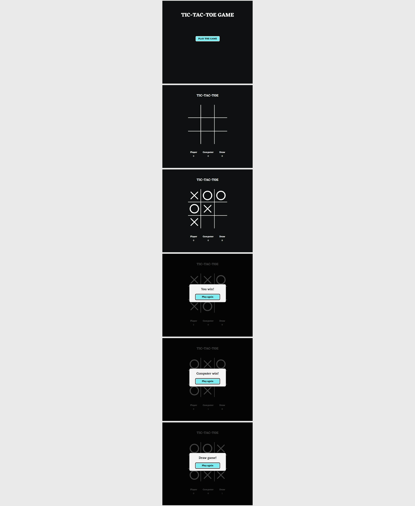

# Игра на Angular - "Крестики-нолики"

Проект выполнен в рамках самостоятельного обучения Frontend-разработке.

## Внешний вид

## Выполненные задачи:
- Практика реализации игры с использованием фреймворка Angular;
- Практика использования встроенных средств Angular (компоненты, роутинг, обмен данными между компонентами);
- Реализация логики и механики игры.

## Используемые технологии:
* Angular 16 (HTML, SCSS, TypeScript)
